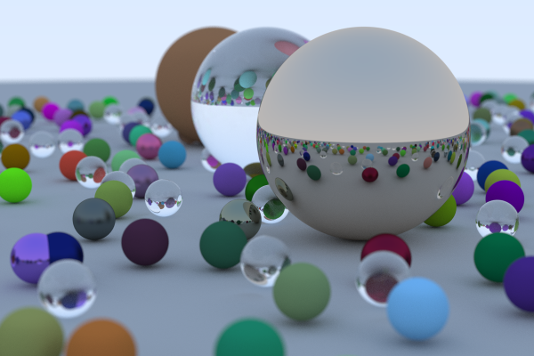
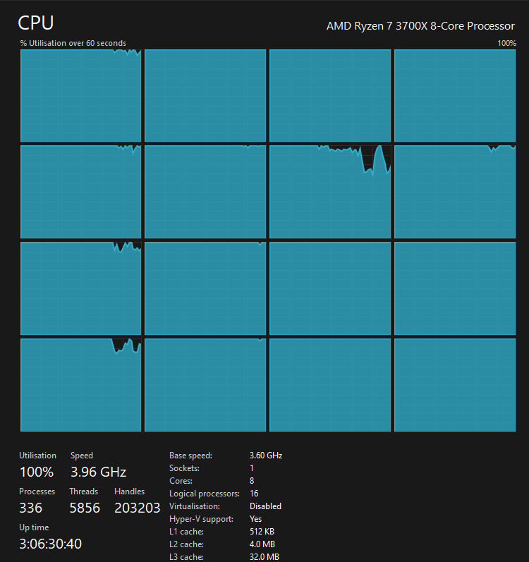

# Illumination-Theory


Ray tracer in written Rust.

Following this: https://raytracing.github.io/books/RayTracingInOneWeekend.html  
With some modifications:
-  Multithreading  ₊˚ʚ ᗢ₊˚✧ ﾟ.
- Direct output to a file
- Running scripts
- Progress bar
## Running
Clone this repo:
```bash
git clone https://github.com/MaximusPrimeForever/Illumination-Theory.git
```

### Options
The script allows you to configure the following values:
- Image width - the aspect ratio is fixed for now to 3:2, so the height will be set accordingly.
- Sample rate - how many rays are simulated per pixel.
- Trace depth - how many times a ray can bounce around the scene until it dies.
- Core count - how many CPU cores should the tracer use. (passing 0 will use all cores.)

**Note**: if rendering a complex scene with parameters turned up on all cores, the render WILL use up ALL of the CPU.



#### Default values
Running the script without passing args will use:
- Image width = 400
- Sample rate = 100
- Trace depth = 10
- Core count = 0 - meaning all cores.


### On Linux
Run the script:
```bash
cd Illumination-Theory
chmod +x ./render.sh

# image_width = 400, sample_rate = 100, trace_depth = 10, core_count = 0
./render.sh image

# image_width = 600, sample_rate = 200, trace_depth = 20, core_count = 0
./render.sh image 600 200 20 0
```

### On Windows
Run the script:
```powershell
cd Illumination-Theory
.\run.ps1 image
```

## Images
You can checkout a tag to get a specific image.  
e.g. this will render an early image with anti aliasing implemented:
```bash
git checkout antialiased_world
./render.sh aa_world
```