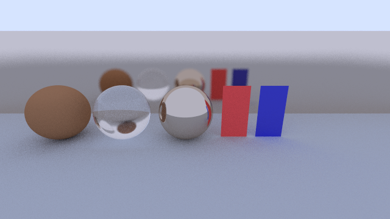

# Illumination-Theory


Ray tracer in written Rust.

Following this: https://raytracing.github.io/.  
With some modifications:
- Multithreading  ₊˚ʚ ᗢ₊˚✧ ﾟ.
    - GPU rendering will be added soon.
- Direct output to a file.
- Progress bar(s).
## Running
Clone this repo:
```bash
git clone https://github.com/MaximusPrimeForever/Illumination-Theory.git
```

### Options
The script allows you to configure the following values:
- Image width
- Aspect ratio - ratio of image width and height.
- Vertical FOV - how wide the image is vertically (affects horizontal FOV as well of course).
- Sample rate - how many rays are simulated per pixel.
- Trace depth - how many times a ray can bounce around the scene until it dies.
- Thread count - how many threads to run in parallel while rendering. This can be increased past the actual CPU core count to divide the image into smaller parts, and thus potentially increasing performance.

**Note**: if rendering a complex scene with parameters turned up on all cores, the render WILL use up ALL of the CPU.


#### Default values
Running the script without passing args will use:
- Image width = 400
- Sample rate = 100
- Trace depth = 10
- Core count = 0 - meaning all cores.


### On Linux
Run the script:
```bash
cd Illumination-Theory
chmod +x ./render.sh

# image_width = 400, sample_rate = 100, trace_depth = 10, core_count = 0
./render.sh image

# image_width = 600, sample_rate = 200, trace_depth = 20, core_count = 0
./render.sh image 600 200 20 0
```

### On Windows
Run the script:
```powershell
cd Illumination-Theory
.\run.ps1 image
```

## Images
You can checkout a tag to get a specific image.  
e.g. this will render an early image with anti aliasing implemented:
```bash
git checkout antialiased_world
./render.sh aa_world
```

## Testing
On August 2023, "Ray Tracing in One Weekend" was updated with a significant refactor (for the better), and while refactoring this code I broke a lot of things.  
So, for the future, here's a test scene to make sure everything looks correct (located in `rtweekend.rs`):


Run:
```powershell
.\run.ps1 -run_test $True
```
Output image `test_scene.png` will be next to the script. if `-run_test $True` is present all other flags are ignored.